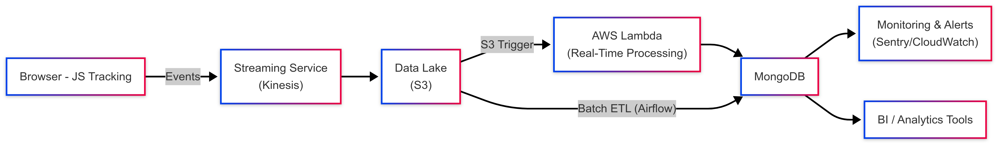

# Comparison Chart Event Data Architecture

## 1. Summary
- Collect high-volume user events (page views, clicks) from a comparison chart.
- Provide real-time and batch data processing for analytics.
- Store data in a scalable, cost-effective manner, and offer monitoring.

## 2. Diagram - 

## 3. Flow Overview
1. JavaScript on the comparison chart sends user events to a streaming service.
2. Events are stored in the Data Lake (S3).
3. Lambda (triggered by S3) handles real-time processing.
4. Airflow manages scheduled batch transformations from S3 to MongoDB.
5. MongoDB houses enriched data for quick queries and dashboarding.
6. Monitoring (logs/alerts) and BI tools enable insights and reporting.

## 4. Key Technologies
- **Streaming Service**: Manages real-time ingestion (Kinesis).
- **S3**: Central data lake for raw input and processed output.
- **Lambda**: Real-time data processing triggered by S3 events.
- **Airflow**: Orchestrates batch ETL workflows.
- **MongoDB**: Flexible document store for enriched event data.
- **Monitoring & Alerts**: CloudWatch, logs, or similar.
- **BI Tools**: Visualization and reporting (Tableau, Looker, QuickSight, etc.).
- Note: Implementation of most features can be done using AWS services - so its easier to manage and scale.

## 5. Implementation Brief
- **Development**:
  - Step 1: Configure JS event capture.
  - Step 2: Set up streaming to S3.
  - Step 3: Trigger real-time Lambda for fast transformations.
  - Step 4: Enable scheduled ETL in Airflow for deeper processing.
- **Testing**:
  - Validate event structure, run integration tests, simulate load.
- **Deployment**:
  - Set up CI/CD for Lambda, Airflow DAGs.
- **Monitoring**:
  - Track errors, performance metrics, alert on anomalies.
- **Cost Optimization**:
  - S3 lifecycle policies (archive infrequently accessed data).
  - Scale streaming and compute based on load.
  - Use on-demand or serverless services when possible.

## 6. Conclusion
This architecture supports real-time visibility into comparison chart interactions while retaining robust batch capabilities, ensuring accurate, timely analytics for decision-making.

Alternatively, In my opinion, if advanced transformations or deep customization are not required, a ready-made platform like FullStory may be sufficient—and potentially more cost-effective—for session tracking and basic analytics.

